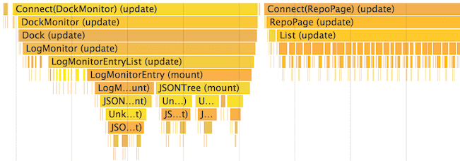

1. Monkey Patch для проверки ререндера React компонентов:
- https://github.com/welldone-software/why-did-you-render

2. Помним что собранный `build` вариант работает куда шустрее без допов.
Через вкладку Network в Chrome проверяем скорость API ответов.

3. Анализ производительности компонентов с помощью вкладки
Chrome «Performance». В режиме разработки вы можете видеть
как компоненты монтируются, обновляются и размонтируются с
помощью инструментов производительности (main=UserTiming)
- 
- [Performance](https://calibreapp.com/blog/react-performance-profiling-optimization)

4. Profiler из ReactDevTools расширения к Chrome
- [Profiler](https://ru.reactjs.org/blog/2018/09/10/introducing-the-react-profiler.html)

5. Виртуализация длинных списков, оконный доступ
- react-window и react-virtualized

6. Мемоизация компонентов: Сравнение условия перерисовки
- shouldComponentUpdate / PureComponent / memo(FC) / useMemo(FC, deps)
```
import React, { memo } from 'react'; // higher order function
export default memo(
  function ContactList({ contacts }) {
    return <List data={contacts} />;
  }
);
```
```
import React, { useMemo } from 'react';
function ContactList({ title, contacts }) {
  const listComponent = useMemo(() => {
    return <List title={title} data={contacts} />;
  }, [contacts]);
  return listComponent;
}
```
```
shouldComponentUpdate(nextProps, nextState) {
  return true;
}
```

7. Использовать немутирующие чистые функции (immutable purse functions)
```
handleClick() {
  this.setState(state => ({
    words: [...state.words, 'словцо'],
  }));
};
```
```
function updateColorMap(colormap) {
  return {...colormap, right: 'blue'};
}
```

8. Мемоизация к Redux
- Immer для редюсеров
- Reselect для селектеров
- shallowEqual для useState

